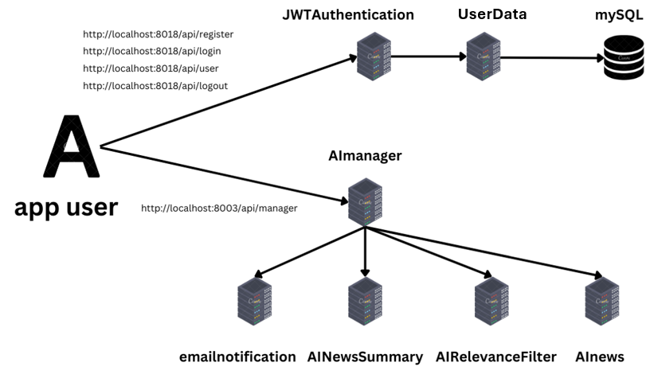

# Personalized News Update Aggregator

## The purpose of the system

The Personalized News Update Aggregator is a microservice-based application designed to aggregate news and technology updates based on user preferences. The system fetches the latest news, selects the most interesting articles using AI, generates concise summaries, and sends this information to users via their preferred communication channels (email).

## Functional Requirements

### User Registration and Preferences:
- I want to register.
- As a user, I want to update my preferences at any time.

### News Aggregation:
- As a user, I want the application to fetch the latest news based on my preferences, pick the most interesting news, generate concise summaries using AI, and send them via email.

### System diagram

## Userdata Server
This Django-based server provides an API for managing user data with the following key components:
- **ViewSet (UserViewSet)**
  - `list`: Lists all users, handles exceptions, and logs errors.
  - `create`: Creates a new user, validates data, handles exceptions, and logs errors.
  - `retrieve`: Retrieves a user by email and password, handles authentication failures, logs warnings, and handles exceptions.
  - `update`: Updates user details, handles authentication failures, validates data, logs warnings, and handles exceptions.

## JWTAuthenticationService Server
The purpose of this server is to manage user authentication and profile operations within an application. It provides endpoints for user registration, login, retrieval, update, and logout, and interacts with an external user service to handle these tasks. The server ensures secure handling of user data, generates JWT tokens for authenticated sessions, and manages cookies for maintaining user sessions.

### Key Classes
- **RegisterView**:
  - `POST`: Validates user data and registers the user via an external service. Logs errors for invalid data and exceptions.
- **LoginView**:
  - `POST`: Authenticates the user, generates a JWT token, and sets it as an HTTP-only cookie.
- **UserView**:
  - `GET`: Retrieves user information based on a JWT token.
  - `PUT`: Updates user data, validating it and sending it to the external service.
- **LogoutView**:
  - `GET`: Logs out the user by deleting the JWT cookie.

## AInews Server
The provided code is a Django REST framework API view that handles requests to fetch news articles based on user preferences. Here's a short description:

### AINews API View:
- **Logging and Cache Setup**:
  - Uses the logging module to log information and errors.
  - Uses Django's cache framework to store and retrieve cached news articles.

- **Post Method**:
  - Extracts email, news_categories, and language from the POST request data.
  - Validates the presence of required parameters (email, news_categories, and language).
  - Generates a cache key based on the user's email, news categories, and language.
  - Checks if the news articles are already cached. If cached, returns the cached news with a 200 OK status.
  - If not cached, it fetches the news articles by calling the `_fetch_news` method, caches the fetched articles, and returns them with a 200 OK status.
  - Handles exceptions by logging the error and returning a 500 Internal Server Error response.

- **Private Methods**:
  - `_generate_cache_key`: Creates a unique cache key based on the email, news categories, and language.
  - `_fetch_news`: Fetches news articles from the NewsData.io API for each specified category and language. It logs warnings and errors if fetching fails.
  - `_process_articles`: Processes the fetched articles to include only the title, description, URL, and content.

**NEEDS**: The API key for NewsData.io to work

## AIRelevanceFilterServer
This code defines a Django REST API endpoint that uses the Google Gemini AI API to filter and sort news articles based on user preferences.

### Key Components
- **Dependencies**: Uses python-dotenv for environment variables and google-generativeai for AI interaction.
- **Configuration**: Loads the Gemini API key and sets up logging and model parameters.

### API Endpoint
- **AINewsFilter APIView**: Handles POST requests with news articles and user preferences.
  - **Error Handling**: Returns a 400 error for missing articles.
  - **Filtering**: Uses the `filter_articles_by_preference` method to assess relevance.
  - **Sorting**: Sorts articles by relevance score and returns the top N articles.

### Helper Methods
- **filter_articles_by_preference**: Filters articles based on their relevance score from the AI.
- **get_relevance_score**: Constructs a prompt for the AI to evaluate relevance, returning a score between 1 and 100.

**NEEDS**: The API key to work

## AINewsSummaryProcessingService
This Django REST framework server defines an AINewsSummary API endpoint that summarizes news articles submitted in a POST request. The `post` method checks for the presence of news articles in the request data and returns an error if none are provided. If articles are present, it calls the `summarize_articles` method to generate summaries for each article.

### Key Components:
- **Logging and Error Handling**: The server uses the logging module to log errors, ensuring proper error reporting when issues arise during article summarization.
- **Rate Limiting**: A `time.sleep(30)` call is included in the `summarize_articles` method to enforce rate limiting, pausing execution for 30 seconds between summarization requests.
- **Summary Generation**: The `generate_summary` method constructs a prompt using a specified template and leverages the Google Gemini model via LangChain to generate a concise summary of each article, returning it for inclusion in the response.
- **Response Management**: The server returns the summarized articles as a JSON response with appropriate HTTP status codes, handling success (200) and errors (400, 500) gracefully.

## Emailnotification Service
The NewsEmailView is a Django REST API that sends email updates with news articles.

### Key Features:
- **Logging**: Tracks events at the INFO level.
- **Email Handling**: Requires an email and a list of news articles.
- **Article Combination**: Combines articles into a formatted string.
- **Email Sending**: Uses smtplib with SSL to send emails via Gmail.
- **Response Handling**: Returns success or error responses based on email status.

### Workflow
1. Client sends a POST request with an email and news articles.
2. Checks for articles and logs an error if absent.
3. Combines articles and attempts to send the email.
4. Returns a success or failure response.

## AImanager Service
Django REST Framework API view that handles user requests for fetching personalized news summaries. Upon receiving a GET request, it verifies the user's JWT token to authenticate the user. If authentication is successful, it retrieves user preferences and other relevant information via an external API call.

### The core functionality is implemented in the `process_news_request` method which is executed in a separate thread to ensure asynchronous execution. This method performs the following steps:
1. **Fetch All News Articles**: It sends a POST request to retrieve all news articles based on the user's data.
2. **Filter Articles**: It filters the fetched articles according to the user's preferences and specified number of articles.
3. **Summarize Articles**: It generates a summary of the filtered articles by calling another external API.
4. **Send Summary via Email**: Finally, it sends the summarized articles to the user's email address.

## Running the Application

### Prerequisites:
- Docker and Docker Compose installed.
- WSL installed (for Windows users).

### Steps:
1. Clone the repository from GitHub.
2. Navigate to the project directory.
3. You need to complete the secrets (API key and email password) for the code to work.(gemini ai,news bi api, email+password) 
4. Run `docker-compose up` to start the application. There is for every project docker-compose file. You have to start them all up. (If there is a problem with the UserData server, this should be done)

### Testing the Application:
- Use Postman file test.
- Ensure that user registration with your email and login to get Cookie and then ask to get the news.

### Actions that can be performed:
- **User Registration**: app user -> `http://localhost:8018/api/register` -> JWTAuthenticationServer -> DatabaseUser -> MySQL
- **User Login**: app user -> `http://localhost:8018/api/login` -> JWTAuthenticationServer -> DatabaseUser -> MySQL
- **User Information**: app user -> `http://localhost:8018/api/user` -> JWTAuthenticationServer -> DatabaseUser -> MySQL
- **User Logout**: app user -> `http://localhost:8018/api/logout` -> JWTAuthenticationServer

### News Aggregation and Notification:
- **News Management**: app user -> `http://localhost:8003/api/manager` -> AImanager -> AInews -> AImanager -> AIRelevanceFilter -> AImanager -> AINewsSummary -> AImanager -> emailnotification

## Technologies Used
- Microservice architecture
- Docker and Docker Compose
- JWT for authentication
- AI APIs (Gemini)
- NewsData.io for fetching news
- Free communication channels (email)
- LangChain
